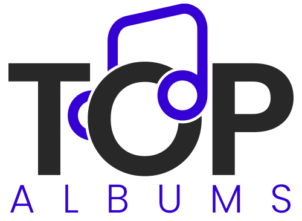

<div id="top"></div>

<!-- [![MIT License][license-shield]][license-url] -->

[![LinkedIn][linkedin-shield]][linkedin-url]

<!-- PROJECT LOGO -->
<br />
<div align="center">
  <a href="https://github.com/lukaszkus/react-native-music-app">
    
  </a>

<h3 align="center">Top Albums</h3>

  <p align="center">
    Top 100 albums by Apple Music.
    <br />
    <br />
  </p>
</div>

<!-- TABLE OF CONTENTS -->
<details>
  <summary>Table of Contents</summary>
  <ol>
    <li>
      <a href="#about-the-project">About The Project</a>
      <ul>
        <li><a href="#built-with">Built With</a></li>
      </ul>
    </li>
    <li>
      <a href="#installation">Installation</a>
    </li>
    <li><a href="#roadmap">Roadmap</a></li>
    <li><a href="#license">License</a></li>
    <li><a href="#contact">Contact</a></li>
    <li><a href="#links">Links</a></li>
  </ol>
</details>

<!-- ABOUT THE PROJECT -->

## About The Project

[![Product Name Screen Shot][product-screenshot-1]](https://github.com/lukaszkus/react-native-music-app/)

The React Native mobile app that displays the top 100 albums based on the iTunes API.

Users are able to:

- Search albums on list in real time by keywords
- Changeing list view to grid view
- Add albums to favourites
- View favourites
- Remove from favourites
- View album details
- Go to album or artist page on Apple Music

### Built With

- [React Native](https://reactnative.dev/)
- [Expo](https://expo.dev/)
- [Axios](https://axios-http.com/)

[![Product Name Screen Shot][product-screenshot-2]](https://github.com/lukaszkus/react-native-music-app/)

<!-- GETTING STARTED -->

## Installation

1. Clone the repo
   ```sh
   git clone git@github.com:lukaszkus/react-native-music-app.git
   ```
2. Install NPM packages
   ```sh
   npm install
   ```
3. Run command

   ```sh
   npm start
   ```

   or

   ```sh
   expo start
   ```

   #### Expo Go

   After running these commands a new window in your browser will open up with information about project.

   To preview project you need to download Expo Client App on your smartphone. Depending on the phone you have you can do this on the App Store, on the Google Play Store or [here](https://expo.dev/client).

   Once you have the Expo Client App installed scan the QR Code that you saw when you ran npm start on the terminal. You will have to wait a couple of minutes at first while project bundles and loads for the first time.

   #### Simulators

   In case you only have either an Iphone or an Android smartphone you are able to use simulators, which will allow you to work on both platforms with ease. To use the simulators you first need to download [Android Studio](https://developer.android.com/studio?gclid=Cj0KCQiAtrnuBRDXARIsABiN-7ANWy_2jX23GHocj9MWMcNmr1bs-ndjSYWDPBQ45cVrcptTbzlAgH0aAmqiEALw_wcB) and Xcode (from the app store).

   <i><b>Warning: If you are using Windows as an operating system you will not be able to download Xcode (due to Apple’s restrictions).</b></i>

   For detailed instructions on how to get the simulator up and running for Android please click [here](https://docs.expo.dev/workflow/android-studio-emulator/?redirected).

   To start the simulator for Iphone please click [here](https://docs.expo.dev/workflow/ios-simulator/?redirected) for steps in how to do so.

   #### APK (Android only)

   Simply download a TopAlbums.apk file from [here](https://github.com/lukaszkus/react-native-music-app/blob/main/apk/TopAlbums.apk) an install it on your device.

<!-- ROADMAP -->

## Roadmap

- User authorization and authentication.
- Advanced search
- Integration with other API's

<!-- LICENSE -->

## License

Distributed under the MIT License. See `LICENSE.txt` for more information.

<!-- CONTACT -->

## Contact

@lukaszkus
<br/>
LinkedIn: [https://www.linkedin.com/in/lukasz-kus](https://www.linkedin.com/in/lukasz-kus/)
<br/>
e-mail: lukasz.kus84@outlook.com

## Links

Project link: [https://github.com/lukaszkus/react-native-music-app](https://github.com/lukaszkus/react-native-music-app)
<br/>

<p align="right">(<a href="#top">back to top</a>)</p>

<!-- MARKDOWN LINKS & IMAGES -->
<!-- https://www.markdownguide.org/basic-syntax/#reference-style-links -->

[license-shield]: https://img.shields.io/github/license/github_username/repo_name.svg?style=for-the-badge
[license-url]: https://github.com/lukaszkus/todo-app/blob/main/LICENSE.txt
[linkedin-shield]: https://img.shields.io/badge/-LinkedIn-black.svg?style=for-the-badge&logo=linkedin&colorB=555
[linkedin-url]: https://www.linkedin.com/in/lukasz-kus/
[product-screenshot-1]: screenshots/screenshot-1.png
[product-screenshot-2]: screenshots/screenshot-2.png
